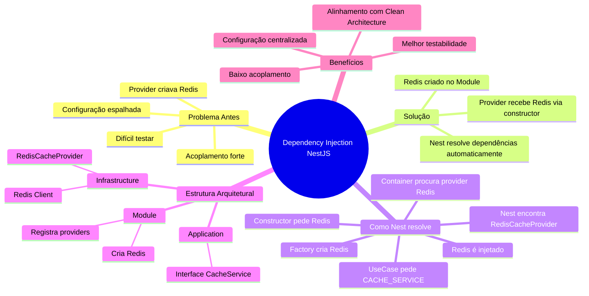

# Redis DI Learning Notes

## Dependency Injection com Redis no NestJS

```mermaid
mindmap
  root((Dependency Injection NestJS))

    Problema Antes
      Provider criava Redis
      Acoplamento forte
      Difícil testar
      Configuração espalhada

    Solução
      Redis criado no Module
      Provider recebe Redis via constructor
      Nest resolve dependências automaticamente

    Como Nest resolve
      UseCase pede CACHE_SERVICE
      Nest encontra RedisCacheProvider
      Constructor pede Redis
      Container procura provider Redis
      Factory cria Redis
      Redis é injetado

    Estrutura Arquitetural
      Application
        Interface CacheService
      Infrastructure
        RedisCacheProvider
        Redis Client
      Module
        Cria Redis
        Registra providers

    Benefícios
      Baixo acoplamento
      Melhor testabilidade
      Configuração centralizada
      Alinhamento com Clean Architecture
```